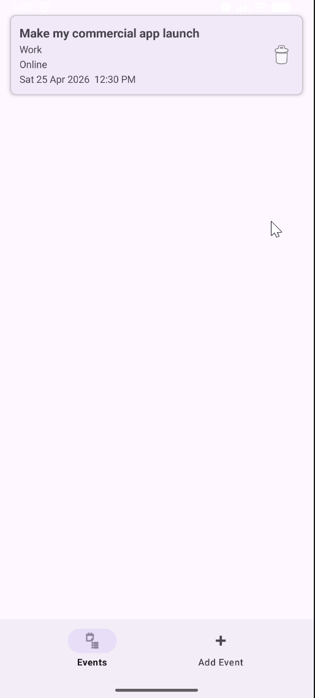
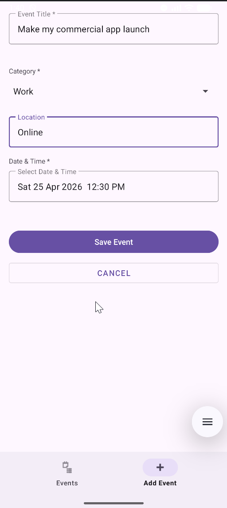
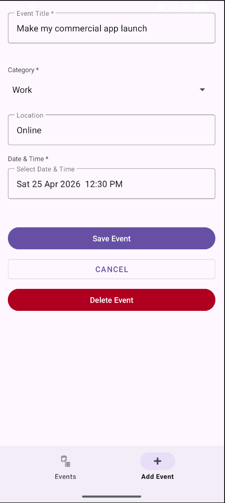

# EventPlanner (Android App)

## Overview
EventPlanner is an Android application that allows users to create, edit, and manage events using a clean UI and local database storage.

The app uses a Room database architecture, RecyclerView for display, and Navigation Components for screen transitions.

---

## Core Functionality

### Event Management
- Create new events
- Edit existing events
- Delete events
- View all events in a list

### UI Navigation
- Single-activity architecture (MainActivity)
- Fragment-based navigation:
  - Event List
  - Add/Edit Event

### Data Persistence
- Local database using Room
- DAO pattern for structured data access

---

## Screenshots

| | | |
|---|---|---|
|  |  |  |
| **Event List** | **Add Event** | **Edit Event** |

---

## Tech Stack
- Language: Java
- Architecture: MVVM-lite (Room + DAO + UI separation)
- Database: Room (SQLite abstraction)
- UI: XML layouts
- Navigation: Android Navigation Component
- Build: Gradle

---

## Project Structure

app/src/main/java/com/example/eventplanner/

- MainActivity.java
- adapter/
  - EventAdapter.java
- data/
  - Event.java
  - EventDao.java
  - EventDatabase.java
- fragments/
  - EventListFragment.java
  - AddEditEventFragment.java

res/layout/
- activity_main.xml
- fragment_event_list.xml
- fragment_add_edit_event.xml
- item_event.xml

res/navigation/
- nav_graph.xml

res/menu/
- bottom_nav_menu.xml

---

## How It Works

1. MainActivity hosts the navigation controller and loads the event list.
2. EventListFragment displays events using RecyclerView.
3. AddEditEventFragment handles creating and editing events.
4. Room database manages persistence through Entity, DAO, and Database classes.

---

## Setup Instructions

1. Clone repository:
   git clone https://github.com/your-username/EventPlanner.git

2. Open in Android Studio.

3. Sync Gradle and run on emulator or device.

---

## Key Components

Event Entity:
Defines the database schema.

EventDao:
Handles CRUD operations.

EventAdapter:
Binds event data to RecyclerView.

Navigation Graph:
Controls fragment transitions.

---

## Dependencies
- AndroidX Core
- RecyclerView
- Room (runtime + compiler)
- Navigation Component

---

## Known Limitations
- No cloud sync
- No notifications/reminders
- No filtering or sorting
- Minimal input validation

---

## Legal

This project was created for educational purposes as part of Deakin University's SIT305 unit. All rights reserved. Reuse, redistribution, or reproduction of any part of this codebase requires explicit written permission from the author.

---

